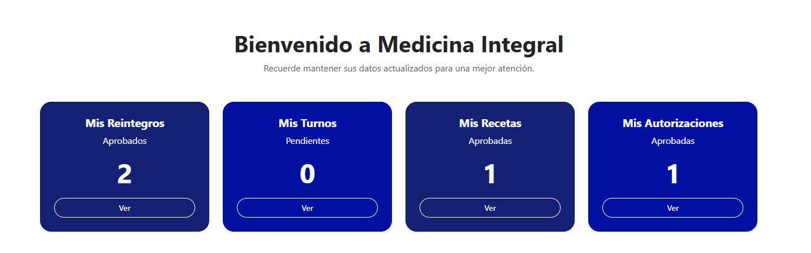
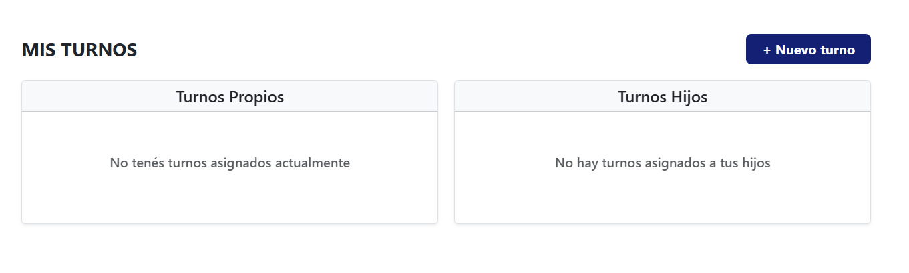
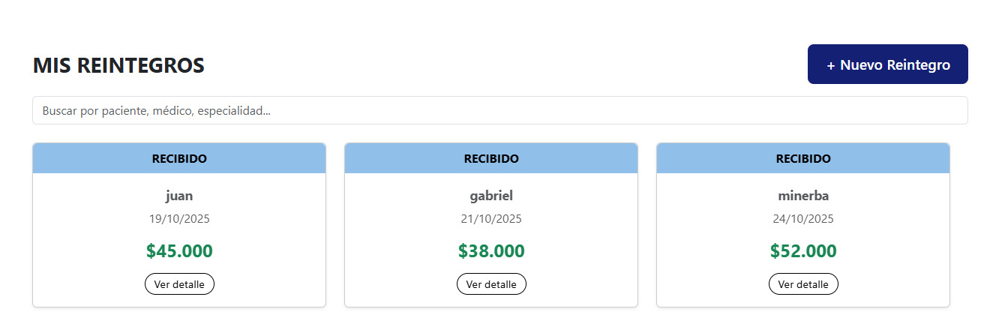
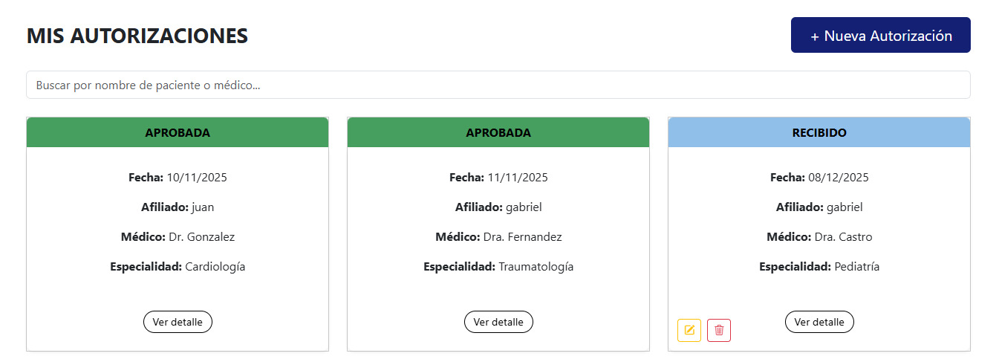
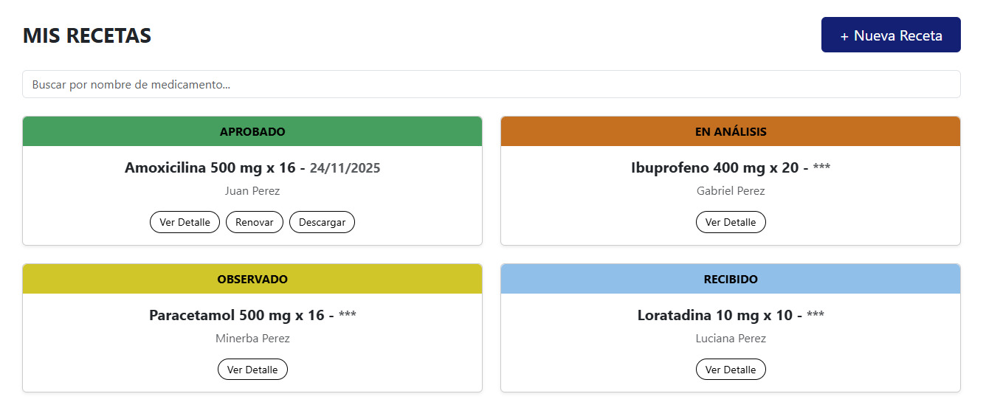
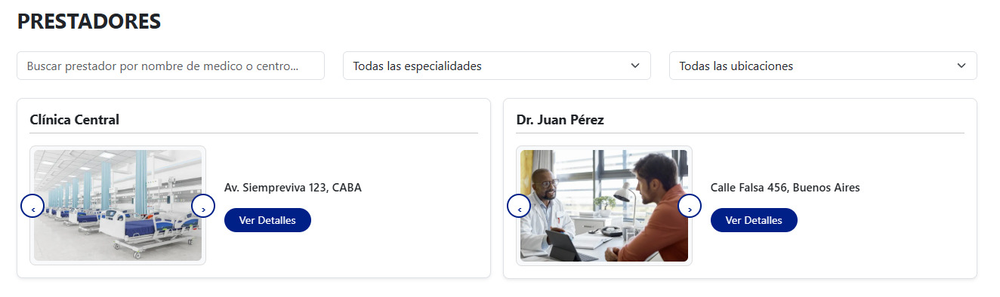

# Acceso de Afiliados y Grupo Familiar — Frontend

## Objetivo

El backend del proyecto **Acceso de Afiliados y Grupo Familiar**  forma parte del sistema desarrollado para la empresa Medicina Integral.
Su propósito es brindar soporte a la aplicación web utilizada por los afiliados, permitiendo la gestión y almacenamiento de información vinculada a servicios médicos y administrativos.

### Accesos según perfil de usuario:

- **Afiliado - Titular:** Acceso completo a sus operaciones y a las del grupo familiar. Puede registrar operaciones para sí y para sus hijos.

- **Cónyuge:** Puede visualizar y registrar operaciones propias y de los hijos.

- **Usuarios menores de 16 años:** Pueden acceder a la plataforma, pero no realizar ningún tipo de operación.

- **Usuarios de 16 años o más:** Habilitados para solicitar turnos exclusivamente para sí mismos.

---
A través de esta aplicación web, los afiliados y algunos miembros del grupo familiar pueden:

-**Home / Inicio:** Permite solicitar turnos según disponibilidad. Los turnos pueden cancelarse hasta un día antes de la fecha asignada
facilitando la gestión desde la web o la app.



-**Solicitar turnos de atención médica:** Permite solicitar turnos según disponibilidad. Los turnos pueden cancelarse hasta un día antes de la fecha asignada
facilitando la gestión desde la web o la app.




- **Gestionar reintegros:** Incluye la presentación de facturas, detalle de prestaciones y elección de forma de pago (cheque, efectivo, transferencia o depósito), garantizando un proceso ágil.



- **Gestionar autorizaciones:** Permite cargar y dar seguimiento a solicitudes de autorización, con notificaciones de estado que aseguran un proceso claro y confiable.



- **Registrar y renovar recetas:** Posibilita cargar, renovar y consultar recetas previas, mostrando los estados actualizados para un seguimiento claro y seguro.




- **Consultar la cartilla de prestadores:** Ofrece acceso a la cartilla actualizada, con filtros por especialidad, zona y ubicación para una búsqueda más rápida y eficiente.



---

## Tecnologías utilizadas

- **JavaScript** — Lenguaje principal del proyecto. Se utiliza para manejar la lógica del frontend, manipular datos, gestionar eventos y comunicar la aplicación con el backend.

- **React** — Biblioteca de JavaScript para construir interfaces de usuario. Permite crear componentes reutilizables, manejar estados y renderizar la vista de forma eficiente.

- **Express** — Framework para Node.js usado en el backend. Sirve para crear rutas, manejar peticiones HTTP y definir la API que el frontend consume.

- **Node.js** — Entorno de ejecución que permite usar JavaScript del lado del servidor. Es la base sobre la cual corre Express y maneja la lógica del backend.

- **Sequelize** — ORM utilizado para interactuar con la base de datos. Facilita la creación de modelos, validaciones y consultas sin escribir SQL manualmente.

- **Vite** — Se utiliza para correr el frontend en desarrollo y generar el build optimizado para producción.

- **Figma** — Herramienta de diseño colaborativo. Se utilizó para crear prototipos, UI layouts y planificar la experiencia visual de la aplicación.

---

## Estructura del proyecto

```
Acceso-de-afiliados-y-grupo-familiar---FE/
├─ node_modules/
├─ public/
│  ├─ imagenes/
│  │  ├─ prestadores/
│  │  │  ├─ 1/
│  │  │  │  ├─ 1.jpg
│  │  │  │  ├─ 2.jpg
│  │  │  │  └─ 3.jpg
│  │  │  ├─ 2/
│  │  │  │  ├─ 1.jpg
│  │  │  │  ├─ 2.jpg
│  │  │  │  └─ 3.jpg
│  │  │  ├─ 3/
│  │  │  │  ├─ 1.jpg
│  │  │  │  ├─ 2.jpg
│  │  │  │  └─ 3.jpg
│  │  │  ├─ 4/
│  │  │  │  ├─ 1.jpg
│  │  │  │  ├─ 2.jpg
│  │  │  │  └─ 3.jpg
│  │  │  ├─ 5/
│  │  │  │  ├─ 1.jpg
│  │  │  │  ├─ 2.jpg
│  │  │  │  └─ 3.jpg
│  │  │  ├─ 6/
│  │  │  │  ├─ 1.jpg
│  │  │  │  ├─ 2.jpg
│  │  │  │  └─ 3.jpg
│  │  │  ├─ 7/
│  │  │  │  ├─ 1.jpg
│  │  │  │  ├─ 2.jpg
│  │  │  │  └─ 3.jpg
│  │  │  ├─ 8/
│  │  │  │  ├─ 1.jpg
│  │  │  │  ├─ 2.jpg
│  │  │  │  └─ 3.jpg
│  │  │  ├─ 9/
│  │  │  │  ├─ 1.jpg
│  │  │  │  ├─ 2.jpg
│  │  │  │  └─ 3.jpg
│  │  │  └─ 10/
│  │  │     ├─ 1.jpg
│  │  │     ├─ 2.jpg
│  │  │     └─ 3.jpg
│  │  ├─ centroMedico/
│  │  │  ├─ 1.jpg
│  │  │  ├─ 2.jpg
│  │  │  ├─ 3.jpg
│  │  │  ├─ 4.jpg
│  │  │  └─ 5.jpg
│  │  └─ logoPDF/
│  │     └─ LogoPDF.jpeg
│  ├─ ImagenesReadme/
│  │  ├─ autorizaciones.jpg
│  │  ├─ prestadores.jpg
│  │  ├─ reintegros.jpg
│  │  ├─ recetas.jpg
│  │  ├─ turnos.jpg
│  │  ├─ home.jpg
│  │  └─ home2.jpg
│  └─ vite.svg
│
├─ src/
│  ├─ assets/
│  │  ├─ icons/
│  │  │  ├─ autorizaciones-1.svg
│  │  │  ├─ autorizaciones-2.svg
│  │  │  ├─ home-1.svg
│  │  │  ├─ home-2.svg
│  │  │  ├─ prestadores-1.svg
│  │  │  ├─ prestadores-2.svg
│  │  │  ├─ recetas-1.svg
│  │  │  ├─ recetas-2.svg
│  │  │  ├─ reintegros-1.svg
│  │  │  ├─ reintegros-2.svg
│  │  │  ├─ turnos-1.svg
│  │  │  └─ turnos-2.svg
│  │  ├─ logo.png
│  │  └─ react.svg
│
│  ├─ components/
│  │  ├─ Cards/
│  │  │  └─ CardPersonalizada.jsx
│  │  ├─ Footer/
│  │  │  ├─ Footer.jsx
│  │  │  └─ Footer.css
│  │  ├─ Form/
│  │  │  ├─ Form.jsx
│  │  │  └─ Form.css
│  │  ├─ Header/
│  │  │  └─ Header.jsx
│  │  ├─ Navbar/
│  │  │  ├─ Navbar.jsx
│  │  │  └─ Navbar.css
│  │  └─ protectedRoutes/
│  │     └─ protectedRoutes.jsx
│
│  ├─ data/
│  │  ├─ grupoFamiliar.json
│  │  └─ reintegros.json
│
│  ├─ pages/
│  │  ├─ autorizaciones/
│  │  │  ├─ autorizaciones.jsx
│  │  │  ├─ buscarAutorizacion.jsx
│  │  │  ├─ cardAutorizacion.jsx
│  │  │  ├─ editarAutorizacion.jsx
│  │  │  ├─ nuevaAutorizacion.jsx
│  │  │  └─ verAutorizacion.jsx
│  │  ├─ home/
│  │  │  └─ Home.jsx
│  │  ├─ login/
│  │  │  ├─ Login.jsx
│  │  │  └─ login.css
│  │  ├─ prestadores/
│  │  │  ├─ PrestadorCard.jsx
│  │  │  ├─ PrestadorDetallesModal.jsx
│  │  │  ├─ PrestadorFilters.jsx
│  │  │  ├─ PrestadorList.jsx
│  │  │  ├─ PrestadorModal.jsx
│  │  │  └─ prestadores.jsx
│  │  ├─ recetas/
│  │  │  ├─ buscarReceta.jsx
│  │  │  ├─ cardReceta.jsx
│  │  │  ├─ descargarReceta.jsx
│  │  │  ├─ nuevaReceta.jsx
│  │  │  ├─ recetas.jsx
│  │  │  ├─ verRecetas.jsx
│  │  │  └─ renovarReceta.jsx
│  │  ├─ register/
│  │  │  ├─ Register.jsx
│  │  │  └─ register.css
│  │  ├─ reintegros/
│  │  │  ├─ CardReintegro.jsx
│  │  │  ├─ ModalDetalleReintegro.jsx
│  │  │  ├─ ModalNuevoReintegro.jsx
│  │  │  ├─ reintegros.jsx
│  │  │  └─ reintegros.css
│  │  └─ turnos/
│  │     ├─ turnos.jsx
│  │     ├─ nuevaTurno.jsx
│  │     ├─ nuevaTurno.css
│  │     └─ turnos.css
│
│  ├─ utils/
│  │  ├─ filtro.js
│  │  ├─ form.js
│  │  └─ utils.js
│
│  ├─ App.css
│  ├─ App.jsx
│  ├─ index.css
│  ├─ main.jsx
│
├─ .gitignore
├─ eslint.config.js
├─ index.html
├─ package-lock.json
├─ package.json
├─ README.md
└─ vite.config.js

```


## Uso

1. Clonar el repositorio.

2. Instalar dependencias: 

```
npm install
```

3. Ejecutar el servidor de desarrollo: 

``` 
npm run dev
```

4. Al iniciar, Vite mostrará algo como:

```
VITE v7.1.9  ready in 666 ms

➜  Local:   http://localhost:5173/
➜  Network: use --host to expose
➜  press h + enter to show help
```

5. Acceder a la aplicación: 

Si estás usando Git Bash, podés abrir el enlace (http://localhost:5173/) directamente presionando
Ctrl + Enter
cuando el link está resaltado en la terminal.
(También podés copiar y pegar la URL en tu navegador de forma manual.)

---

## Autores

Proyecto académico desarrollado en el marco de la materia Desarrollo de Aplicaciones- 2do cuatrimestre 2025 - Grupo  N° 12 - Universidad Nacional de Hurlingham (UnaHur).

* Gabriel Facundo Gutiérrez.
* Luana Belén Calderón.
* Ezequiel Escobar.
* Franco Cantero.
* Diego Andrés Primera.

---

